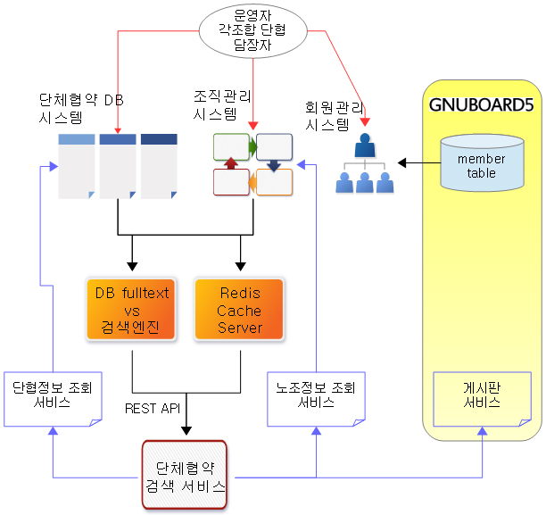

시스템 개요
===========

1. 조직관리 시스템
========================
------------------------

노동조합의 단체협약 특성상 조직관리 시스템이 필수적이다. 

이 시스템은 비슷한 업종의 다른 노조 단협을 검색하여 단체협약시 도움을 주고자 제작되었음.
노조는 업종과 지역을 기반으로 체계화되어 있는 조직이므로 조직데이터베이스는 검색에 용이함을 제공해줄 수 있다.
하지만 무엇보다 조직관리 시스템이 필요한 이유는 단협DB 구축이 중앙집중적으로 이루어지기 때문이다.
개별 노조가 알아서 직접 입력하면 좋겠지만, 현실적으로는 상위 산별노조 조직팀에서 수거하여 일괄 업로드하는 방식으로 진행될수 밖에 없다.
상위노조에서 일괄 업로드를 하기 위해서또 조직관리 데이터베이스 구축은 필수적이다.

1. 유연한 Hierarchy 구조
------------------------
* 노조는 새로 만들어지기도 하지만, 해산하기도 한다. 더불어 상급 단위가 변경되거나 통폐합 되기도 한다. 따라서 유연한 Hierarchy 구조를 가져야 한다.

2. 유연한 조직특성 관리
-----------------------
* 각각의 노조는 현재 아래와 여러 특성 값들을 갖는다. 각각의 값들은 필수일 수도 선택적일 수도 있다.
  * 노조명 : (예) 공공운수노조
  * 본부명 : 
  * 지부명 : 
  * 지회/분회명 :
  * 노총명 : 민주노총/한국노총/무상급
  * 산별연맹 : 
  * 업종조직 : 공공연구노조 | 의료연대본부 | 공항항만운송본부 | 교육공무직본부 | 화물연대본부 | 문화예술협의회 | 버스협의회 | 보육협의회 | 전문기술협의회 | 지역지부협의회 | 지자체협의회 | 철도지하철협의회 | 항공협의회 | 환경에너지협의회 | 운수협의회 | 경제사회협의회
  * 지역 : 전국 | 서울 | 인천 | 부산 | 대구 | 울산 | 광주 | 대전 | 경기도 | 강원도 | 충복 | 충남 | 전북 | 전남 | 경북 | 경남 | 제주
  * 복수노조 : 유/무
  * 과반노조여부 : 가/부
  * 조합원수 : 
  * 사업장명(원청) : 
  * 사업장명(하청) :
  * 특성 : 공공기관 | 교육기관 | 중앙행정기관 | 지자체 | 민간
    * 공공기관 : 위 특성에서 공공기관의 경우 < 공기업 | 준정부 | 기타 | 광역지방공기업 | 기초지방공기업 >
    * 지자체 : 위 특성에서 지자체인 경우 < 광역 | 기초 | 출자출연기관 | 기타(지자체 유관 기관이나 지방공기업, 출자출연기관이 아닌 기관) >
  * 고용형태 : 정규직 | 무기계약직(공무직) | 계약직 | 파견,용역 | 위탁 | 특수고용
  * 산업/직종 : 운수업 | 버스 | 지하철 | 에너지 | 교육서비스 | 보건의료 | 병원 | 요양 | 사회복지 | 보육 | 교통약자이동지원 | 시설관리공단 | 도시공사 | 도로보수 | 환경미화 | 공원관리 | 예술단 | 연구기관 | 휴게소 | 청소 | 경비 | 급식 | 주차관리 | 검침 | 시설관리 | 사무직 | 사무보조 | 운전 | 강사
  * 관련부처 :
    * 기획재정부
	  * 관세청
	* 미래창조과학부
	* 교육부
	* 국토교통부
	* 행정자치부
	  * 경찰청
    * 문화체육관광부
	  * 문화재청
	* 농림축산식품부
	  * 산림청
	  * 농촌진흥청
	* 산업통상자원부
	  * 중소기업청
	  * 특허청
	* 보건복지부
	  * 식의약품안전처
	* 환경부
	* 고용노동부
	* 여성가족부
	* 해양수산부
	* 외교부
	* 통일부
	* 법무부
	* 국방부
	  * 방위사업청
	* 국무총리직속
	  * 국무조정실
	  * 인사혁신처
	  * 금융위원회
	  * 공정거래위원회
	  * 원자력안전위원회
	  * 국가보훈처
	  * 국민안전처
  * 사업장정보 :
    * 대표자명 :
    * 전화 :
    * 주소 :
    * 홈페이지 : 
* 특성 필드는 언제든 필요에 따라 추가/삭제 될수도 있다. 각각의 특성필드 선택값들도 추가/삭제/통합될 수 있다. 예를 들어 관련부처는 정부조각에 따라 언제든 개편될 수 있다.
* 이후 추가 서비스 연동을 염두해두고 설계/개발.

3. History 관리
---------------
* 여러 이유로 조직정보가 변경되었을 때, 변경사를 history 형태로 유지하여야 한다.
* 단협검색에는 최신 단협만 노출되겠지만, 향후 단협변천사등 지난 단협정보에서는 구 조직명이 표시되어 한다.
* 조직 특성값의 변동도 history를 남겨야 한다.
* 모든 history 데이터에는 수정한 아이디와 시간 정보를 기록한다.

2. 회원관리 시스템
========================
------------------------

1차 개발단계에서는 단협검색서비스를 여러 이유로 회원제로 운영하기로 결정하였다.

단협DB 시스템은 현재 조직된 노동조합만을 대상으로 하지는 않는다. 신생노조를 만드려는 분도 이용자가 될수 있고, 연구자도 이용자가 될 수 있다.
따라서 이용자 DB는 조직DB와 정확히 일치할 필요는 없다.
조직 DB와 연동된 이용자는 자기 조직의 정보를 관리하거나 자기 노조의 단협 정보를 입력/수정 할 수 있는 권한을 부여받는다.

1. 회원가입 및 관리
-------------------
* 1차 개발단계에서는 이용자 가입신청을 받지 않고, 운영자가 직접 발급해주는 것으로 시작.
* 관리페이지 기능
  * 회원검색
  * 회원추가
  * 회원정보변경(비번변경등)
  * 회원삭제

2. 조직DB와의 연동
------------------
* 회원관리페이지에서 운영자가 해당 조직 선택
* 조직DB와 연동된 아이디만이 해당 조직의 정보를 수정하거나, 해당 조직의 단협 내용을 추가/수정 할 수 있다.(삭제는 불능)
* 로그관리
  * 로그인/검색 등에 대해서는 로그를 남기지 않음
  * 조직정보를 수정하거나 단협내용을 편집하는 과정에서는 각각 조직 history / 단협 history 정보에 사용자정보와 시간 기록.

3. 단체협약 DB 시스템
========================
------------------------

모든 단협이 조직의 상황에 따라 모두 다르기는 하지만, 비교적 공통으로 묶어 상호 비교할 수 있는 주제들로 조합되어 있다. 그리고 대부분의 산별노조의 경우 산하 노조들의 단협 지원을 위한, 표준단협안이 있다. 단협 DB 시스템은 표준단협안의 조항들을 기반으로 분류조항을 만들고, 이를 각 개별 사업장 노조의 단협과 연계시켜, 상호 비교할 수 있도록 지원한다.

이 시스템의 목적이 비슷한 업종이나 직종간 비교를 통한 단협협상력 향상이다. 단순한 조항검색 외에도 직종/업종 검색을 강화한다.

1. 표준단협과 표준분류 단협조항
-------------------------------

2. 개별 단협 입력/수정 편집기
-----------------------------

3. 일괄 업로드
--------------

4. DB 검색 조건
---------------

5. DB 검색 UI
-------------
